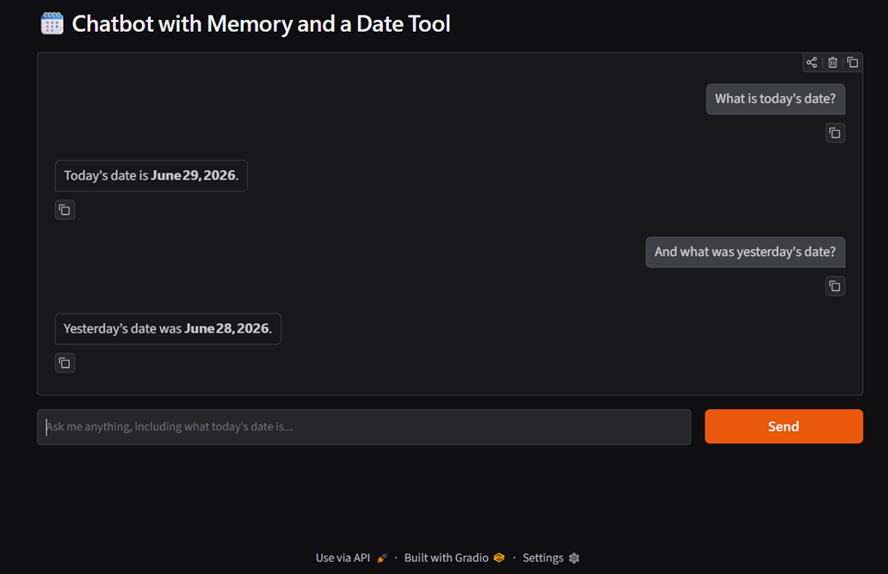

# Week 3 - Mixed Skills Problem Set

## Project Overview

This problem set combines skills from Weeks 1–3: calling Groq's LLM API directly, computing sentence embeddings, building a LangGraph tool-using agent, doing RAG without a vector database, and wiring an agent with memory into a Gradio chat UI.

A note up front: the brief names `llama-3.3-70b-versatile` and (implicitly via Week 1/3 conventions) `llama-3.1-8b-instant`. Both were deprecated by Groq on 2026-06-17. All tasks here use `openai/gpt-oss-120b` instead — Groq's recommended replacement for both.

---

## Task 1 — Basic LLM Chat

**File:** `task1.py`

Reads a system prompt and a user prompt (interactively or via CLI args), calls Groq, and prints the response. The simplest possible LLM call — just message formatting and an API key from `.env`.

**Output:**

```
System: You are a cheerful bot that always ends your replies with a smiley face.
User: How are you today?
I'm doing great, thank you for asking! Ready to help you with anything you need today. :)
```

---

## Task 2 — Cosine Similarity Between Sentences

**File:** `task2.py`

Embeds two sentences with `sentence-transformers/all-MiniLM-L6-v2` and computes their cosine similarity with `sklearn.metrics.pairwise.cosine_similarity`.

**Output:**

```
Sentence A: The cat sleeps on the mat.
Sentence B: A cat is resting on the rug.
Cosine Similarity: 0.65
```

---

## Task 3 — One-Tool Agent

**File:** `task3.py`

A minimal LangGraph `create_react_agent` with a single `add_numbers` tool. Confirms the agent is actually calling the tool rather than just answering from its own arithmetic.

**Output:**

```
User: What is 12 + 15?
Agent: 12 + 15 = 27.
```

---

## Task 4 — Simple RAG with an In-Memory Vector Store

**File:** `task4.py`

No ChromaDB — five short documents are embedded and kept in a plain Python list. A query is embedded, compared against all five via manual cosine similarity, and the single best match is fed to Groq as the *only* allowed context.

**Output:**

```
Query: How do we represent text for search?
Retrieved (similarity=0.57): Embeddings map text to dense vectors for semantic search.
Answer: We represent the text using embeddings—dense vector representations that capture its meaning for semantic search.
```

---

## Task 5 — Chatbot with Memory and a Date Tool

**File:** `task5.py`

A Gradio chat app backed by a LangGraph agent with one tool (`get_current_date`) and a `MemorySaver` checkpointer, so follow-up questions in the same session have context. Tested with the brief's exact two-turn example — the second answer is computed from memory of the first, not a second tool call.



---

## Challenges Faced

- **Deprecated models** — `llama-3.3-70b-versatile` and `llama-3.1-8b-instant`, both named (directly or by convention) in the brief, were deprecated by Groq on 2026-06-17. Swapped to `openai/gpt-oss-120b` across all tasks.
- **Harmless warnings** — an "unauthenticated requests to HF Hub" notice appears the first time `sentence-transformers` downloads the embedding model (Tasks 2 and 4); a `LangGraphDeprecatedSinceV10` warning appears on `create_react_agent` (Tasks 3 and 5), since LangGraph is migrating it to `langchain.agents.create_agent` in a future major version. Neither affects functionality.

---

## Install Dependencies

```bash
pip install -r requirements.txt
```

## Running Each Task

```bash
python task1.py
python task2.py
python task3.py
python task4.py
python task5.py
```