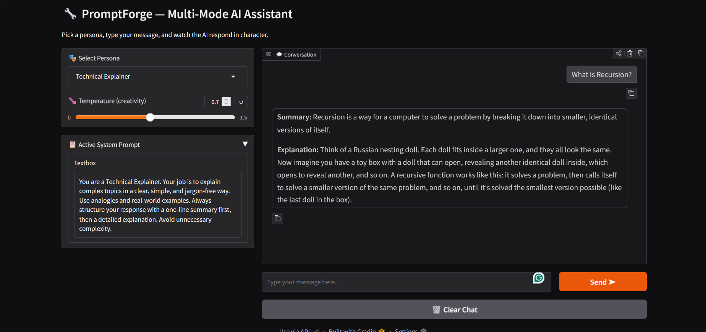
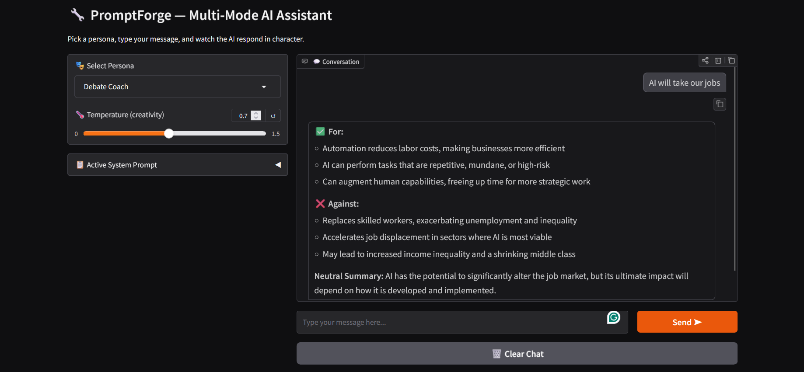
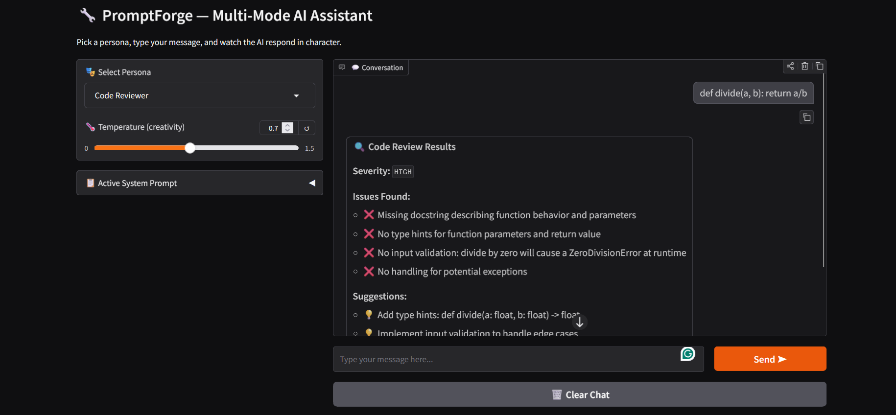
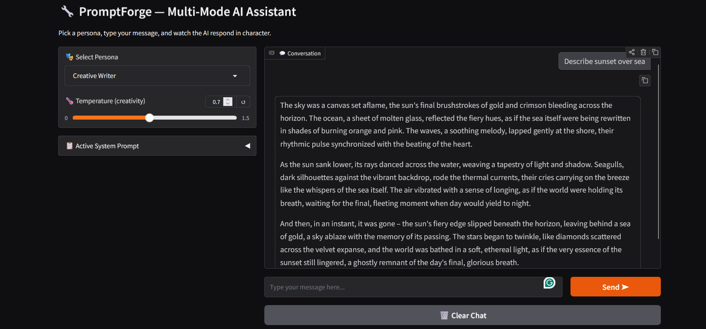

# 🔧 PromptForge — Multi-Mode AI Assistant

A Gradio web app with 4 selectable AI personas, each with a unique system prompt,
few-shot examples, and output style. Built as Week 1 project for GenAI Summer of Code 2026.

---

## 🚀 How to Run Locally

1. Clone the repo
   git clone https://github.com/dhanyamankad/genai-soc-2026.git
   cd genai-soc-2026/week1-promptforge

2. Create and activate a virtual environment
   python -m venv venv
   venv\Scripts\activate        # Windows
   source venv/bin/activate     # Mac/Linux

3. Install dependencies
   pip install -r requirements.txt

4. Set up your API key
   Copy .env.example to .env and add your Groq API key:
   GROQ_API_KEY=your_key_here

5. Run the app
   python app.py

Then open http://127.0.0.1:7860 in your browser.

---

## 🎭 The 4 Personas

### 1. Technical Explainer
Explains complex topics clearly using analogies and real-world examples.
Always gives a one-line summary followed by a detailed explanation.

### 2. Debate Coach
Argues both sides of any topic — For and Against — with bullet points.
Never takes a personal stance. Ends with a neutral summary.

### 3. Code Reviewer
Reviews code and returns structured JSON with issues, suggestions, and severity.
The app parses and renders this as formatted Markdown automatically.

### 4. Creative Writer
Responds in vivid, cinematic prose with sensory details and metaphors.

---

## 🧠 Concepts Used

- **System Prompts** — each persona has unique instructions sent to the AI before the conversation
- **Few-Shot Examples** — sample Q&A pairs injected before the user message to guide the AI's style
- **Streaming** — responses appear token by token using Groq's stream=True and Python generators
- **JSON Rendering** — Code Reviewer output is parsed with json.loads() and rendered as Markdown
- **Temperature Control** — slider lets users control response creativity (0.0 to 1.5)
- **Gradio Blocks** — UI built entirely in Python with no HTML or CSS

---

## 📁 Project Structure

week1-promptforge/
├── app.py              # main application
├── requirements.txt    # dependencies
├── .env.example        # API key template
├── .gitignore          # keeps .env private
└── screenshots/        # one screenshot per persona

---

## ⚙️ Requirements

- Python 3.8+
- Groq API key (free at console.groq.com)
