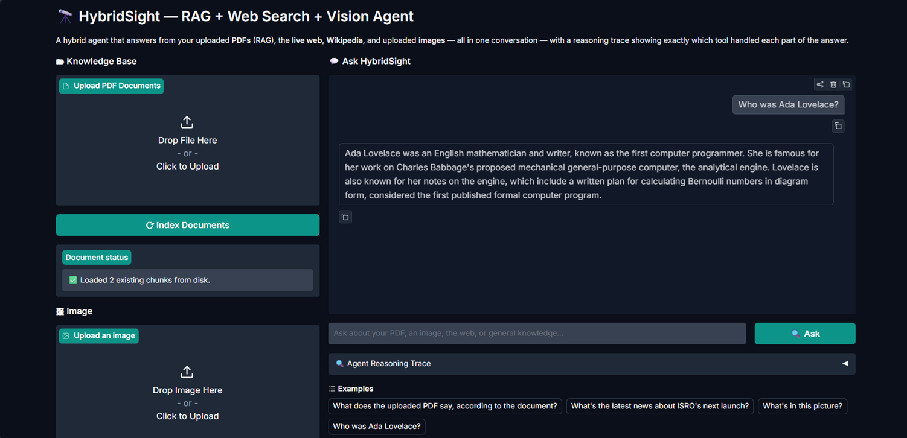
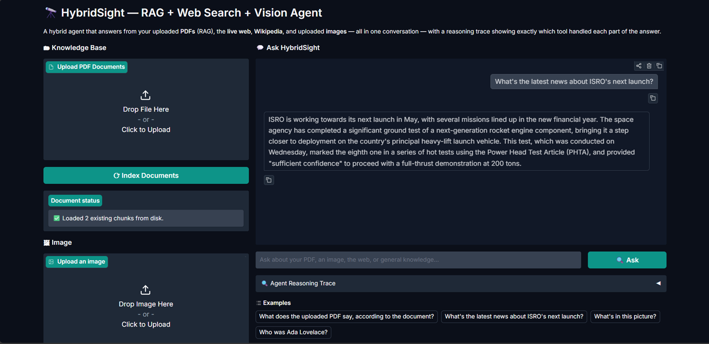
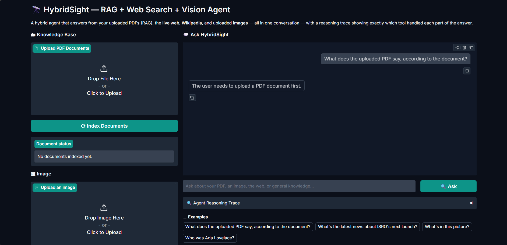
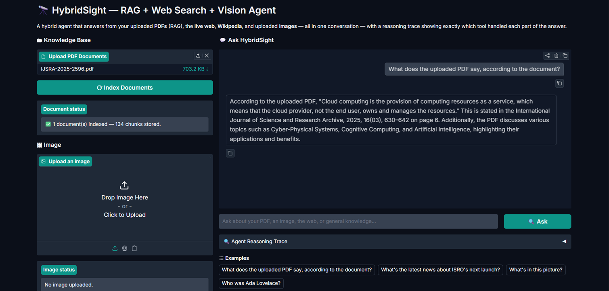
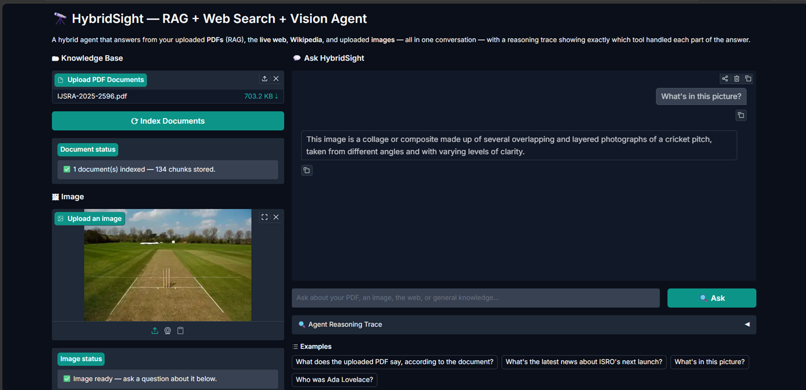

# 🔭 HybridSight — RAG + Web Search + Vision Agent

A Gradio app backed by a LangGraph ReAct agent with **four tools**: a RAG tool
over your own uploaded PDFs (ChromaDB), live web search (DuckDuckGo),
encyclopaedic lookups (Wikipedia), and a vision tool that describes uploaded
images — all in one conversation, with a collapsible "reasoning trace" panel
showing exactly which tool handled each part of the answer.

## 🛠️ Tools Used
| Tool | Purpose |
|------|---------|
| `search_documents` | RAG over uploaded PDFs, via the Week 2 chunk → embed → store ChromaDB pipeline. Returns chunks with source + page number. |
| `describe_image` | Describes/answers questions about the most recently uploaded image via a Groq vision model. |
| `DuckDuckGoSearchRun` | Real-time web search for current news and recent events. |
| `wikipedia_search` | General knowledge and historical facts from Wikipedia, with a DuckDuckGo-scoped fallback if the Wikipedia API is unreachable. |

## ⚠️ Two deviations from the original brief (and why)

- **Vision model:** the brief specifies `llama-3.2-11b-vision-preview`, which
  Groq has decommissioned. Its replacement, `llama-4-scout-17b-16e-instruct`,
  was itself marked for deprecation on 2026-06-17. This app uses the
  currently-recommended `qwen/qwen3.6-27b` instead — see `VISION_MODEL` in
  `tools_vision.py`. It's a "thinking" model, so `reasoning_effort="none"` is
  set to keep its `<think>` reasoning out of the final answer.
- **Wikipedia tool:** Week 3 (AgentX) quietly used DuckDuckGo under the
  `WikipediaQueryRun` name because the real Wikipedia API was blocked on some
  ISPs. This week implements an actual `WikipediaQueryRun` call so the agent
  genuinely has 4 distinct tools, but falls back to a DuckDuckGo search scoped
  to `site:wikipedia.org` if the direct call fails.

## 🚀 Setup & Installation

```powershell
cd D:\genai-soc-2026\week5-hybridsight
python -m venv venv
venv\Scripts\activate
pip install -r requirements.txt
```

Add your real Groq key to `.env`:
GROQ_API_KEY=your_real_key_here

Run it:
```powershell
python app.py
```

## 📸 Test Results

### Test 1 — Wikipedia Lookup
*"Who was Ada Lovelace?" → routed to `wikipedia_search`*


### Test 2 — Live Web Search
*"What's the latest news about ISRO's next launch?" → routed to `DuckDuckGoSearchRun`*


### Test 3 — Empty Knowledge Base
*Document-specific question asked before any PDF was uploaded → graceful "no documents" message instead of guessing*


### Test 4 — RAG Over an Uploaded PDF
*Question answerable from an uploaded PDF → routed to `search_documents`*


### Test 5 — Vision
*"What's in this picture?" after uploading an image → routed to `describe_image`*



## 🧠 How It Works
- **Indexing** — uploading PDFs and clicking "Index Documents" runs the same
  chunk (500 chars, 100 overlap) → embed (`all-MiniLM-L6-v2`) → store
  (ChromaDB, `./chroma_store`) pipeline as Week 2's DocBuddy Pro.
- **Vision** — uploading an image base64-encodes it client-side in `app.py`
  and stores it as the agent's "current image"; `describe_image` reads from
  that rather than requiring the LLM to pass image bytes as a tool argument.
- **Routing** — the system prompt in `agent.py` gives explicit priority rules
  (documents → image → web → Wikipedia) and the ReAct agent decides which
  tool(s) to call per question.
- **Reasoning Trace** — `agent.stream(..., stream_mode="updates")` captures
  every tool call and result as it happens, displayed in the accordion.
- **Memory** — each browser tab gets a UUID session id (`gr.State`) used as
  the `thread_id` for LangGraph's `MemorySaver`, so follow-ups in the same
  session have context.

## ⚠️ What I'd Improve
- `search_documents` re-indexes from scratch on every upload rather than
  incrementally appending — fine for coursework, would need de-duplication
  for a larger knowledge base.
- The vision tool only "remembers" the single most recently uploaded image;
  multi-image conversations would need a small image history instead of one
  global slot.
- `wikipedia_search`'s fallback is a DuckDuckGo search scoped to
  `site:wikipedia.org`, not a true Wikipedia API call — good enough for
  resilience, not a perfect substitute.

## 📦 Tech Stack
- [LangGraph](https://github.com/langchain-ai/langgraph) — Agent framework (ReAct agent, streaming trace)
- [LangChain](https://github.com/langchain-ai/langchain) — Tool integrations
- [ChromaDB](https://www.trychroma.com/) + [sentence-transformers](https://www.sbert.net/) — RAG vector store + embeddings
- [Groq](https://groq.com) — LLM inference (`llama-3.1-8b-instant`) and vision (`qwen/qwen3.6-27b`)
- [DuckDuckGo Search](https://pypi.org/project/duckduckgo-search/) / [Wikipedia](https://pypi.org/project/wikipedia/) — web + encyclopaedic lookups
- [Gradio](https://gradio.app) — UI framework